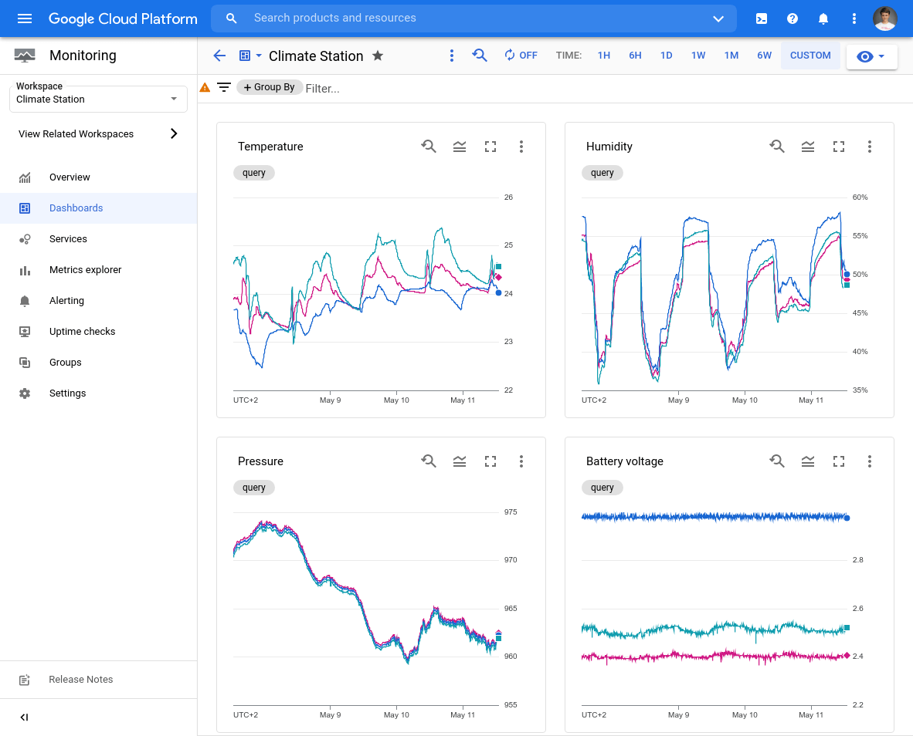

# gbcsdpd

gbcsdpd is a simple Go Bluetooth Climate Sensor Data Publisher Daemon: it
listens for BLE advertisements containing measurements from Bluetooth sensors,
parses them, and publishes via [MQTT](https://mqtt.org/) protocol or directly
to Cloud Pub/Sub.

Currently, it supports only [RuuviTag](https://ruuvi.com/ruuvitag/) sensors but
it should be easy to add support for more.

This repository also contains
[instructions with Terraform configuration](infra/) for setting up a Google
Cloud project to gather and present measurements on a monitoring dashboard:

Deamon targets Linux and depends on the high-level
[BlueZ D-Bus API](https://git.kernel.org/pub/scm/bluetooth/bluez.git/tree/doc/).

## Documentation

The documentation is placed near the code.

Best start at the building, usage, and configuration of the daemon described in
[cmd/gbcsdpd/](cmd/gbcsdpd/).

[infra/](infra/) contains documentation for setting up receiver and monitoring
dashboard on GCP.

## Contributing

See [`CONTRIBUTING.md`](CONTRIBUTING.md) for details.

## License

Apache 2.0; see [`LICENSE`](LICENSE) for details.

## Disclaimer

This is not an officially supported Google product.
